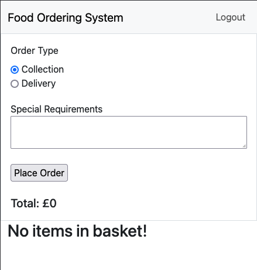

# Food Ordering System

## Overview

### Purpose
The primary function of this project is to allow a takeaway restaurant to accept orders over the Internet. This is facilitated by enabling customers to see all available menu items, select the items they wish to order by adding them to their basket, and then place their order. The restaurant can view the order and fulfil it.

This system has many advantages over the more traditional method of taking orders over the phone which can be susceptible to miscommunication, the inability to take multiple orders and once and the lack of being able to take secure payment.

### Deployment (For local development on Ubuntu)

Prerequisites: Python 3

1. Clone the repository
    ```bash
    git clone https://github.com/Russlyman/food-ordering-system
    ```

2. Change to repository directory
    ```bash
    cd food-ordering-system
    ```

3. Create virtual environment
    ```bash
    python3 -m venv .venv
    ```

4. Activate virtual environment
    ```bash
    source .venv/bin/activate
    ```

5. Install project requirements
    ```bash
    pip3 install -r requirements.txt
    ```

6. Create an env.py file
    ```bash
    touch env.py
    ```

7. Edit env.py and paste template
    ```python
    import os

    os.environ["DATABASE_URL"] = "CHANGE_ME"
    os.environ["SECRET_KEY"] = "CHANGE_ME"
    os.environ["CLOUDINARY_URL"] = "CHANGE_ME"
    ```

8. Generate a secret key at [Djcrety](https://djecrety.ir/) and use for **SECRET_KEY**

9. Get your [Cloudinary URL](https://console.cloudinary.com/settings/api-keys) and use for **CLOUDINARY_URL**

10. Get database connection string from [CI-Dbs](https://dbs.ci-dbs.net/) or from another PostgreSQL server and use for **DATABASE_URL**

11. Save env.py

12. Apply migrations to DB.
    ```bash
    python3 manage.py migrate
    ```

13. Create an admin user
    ```bash
    python3 manage.py createsuperuser 
    ```

14. Start server
    ```bash
    python3 manage.py runserver 
    ```

### Target Audience
This project aims to cater to owners of small—to medium-sized takeaway restaurants who are not currently taking orders over the Internet or using a mainstream app and are looking to reduce costs or have an existing solution that does not suffice.

## User Stories

### Must-Have User Stories
- **User Story 1:** As a customer I can see a list of menu items so that I can decide what I want to eat

  **Acceptance Criteria:**
    - Database model created for storing food items and another for categories.
    - Name and price of each food item is displayed.
    - Food items are group by their category.
- **User Story 2:** As a customer I can add and remove items from my basket so that I can declare what items I want to order

  **Acceptance Criteria:**
    - Items can be added or removed from the basket.
    - Basket total price and total quantity are displayed.
    - Items with multiple quantities are grouped together.
- **User Story 3:** As a customer I can place an order using the contents of my basket so that the restaurant can prepare my food

  **Acceptance Criteria:**
    - Name, Email and Phone Number Fields
    - Order number is displayed on completion
    - Collection or delivery radio
- **User Story 4:** As an employee I can view all the placed orders so that I can prepare them for the customer

  **Acceptance Criteria:**
    - List of all placed orders
    - Show time order was placed and order info
    - Dismiss button

### Should-Have User Stories
- **User Story 1:** As a customer I can specify special instructions for each item in the basket so that I can inform the restaurant of any changes they need to make

  **Acceptance Criteria:**
    - Special instructions field for each item and overall order.
- **User Story 2:** As a customer I can search for items so that I can save time if I have an exact item in mind

  **Acceptance Criteria:**
    - Search box that provides immediate feedback as customer types
- **User Story 3:** As a customer I can jump down the menu by category so that save time by not scrolling

  **Acceptance Criteria:**
    - Sidebar containing all the category names
    - Clicking a category name scrolls to that category

### Could-Have User Stories
- **User Story 1:** As a customer I can pay by card so that I can pay over the Internet as an alternative to cash

  **Acceptance Criteria:**
    - Card option in checkout
    - Order is marked as placed once payment has been received

## Design Decisions

### Entity Relationship Diagram

I created my ERD diagram using Lucidchart, it represents the database structure for the MVP version of the project which consists of all the must-have user stories. I decided not to include the default User model in my ERD as this is declared by Django and is subject to change in newer releases.

[Lucidchart ERD Document](https://lucid.app/lucidchart/513e4c27-842a-4319-9b4e-faada636017d/edit?invitationId=inv_195ab741-b650-4ba0-a9ee-729f737c8205)

### Wireframes
[](docs_images/wireframes/mobile.png)
[](docs_images/wireframes/tablet.png)
[](docs_images/wireframes/desktop.png)
Here are the wireframes I created for this project using Balsamiq Wireframes, I created them using a mobile-first approach. To see a larger view of each wireframe, please click each wireframe to open a full-sized image.

[Balsamiq Wireframes File](docs_images/wireframes/wireframe.bmpr)

### Accessibility Considerations
The project currently utilises the base Bootstrap styling so there is no concern regarding colour contrast as it's already compliant, alt-text has been added to images.

## Testing and Validation

|Test|Pass|
|-|-|
|Can Login|X|
|Can Logout|X|
|Can Register|X|
|Can add Item to basket|X|
|Can modify item quantity|X|
|Can delete item from basket|X|

### Reponsiveness
As can be observed below, the website behaves responsively depending on the screen size and as my wireframe diagrams intended.




### Validation

#### PageSpeed Test
I did a PageSpeed test on the website which is essentially a browser version of the Lighthouse test bundled with Google Chrome.


#### W3C Validator HTML


#### W3C Validator CSS


## Code Attribution
- Bootstrap 5.3 Docs for various components

## Future Improvements
- Using React and changing the project to serve API endpoints instead of templates.
- Allow restaurant owners to CRUD items and categories without having to access admin panel.
- Style the project.
- Implement remaining user stories.